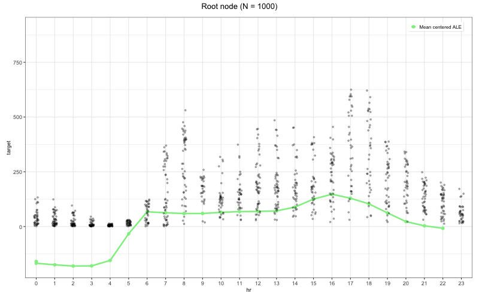
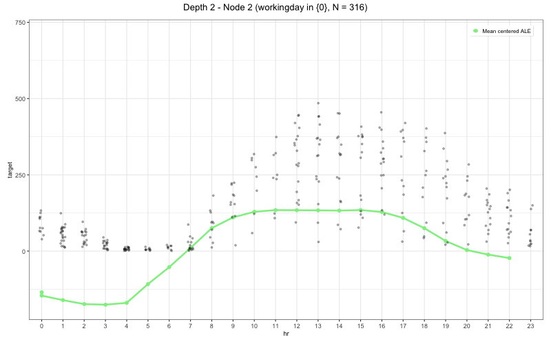
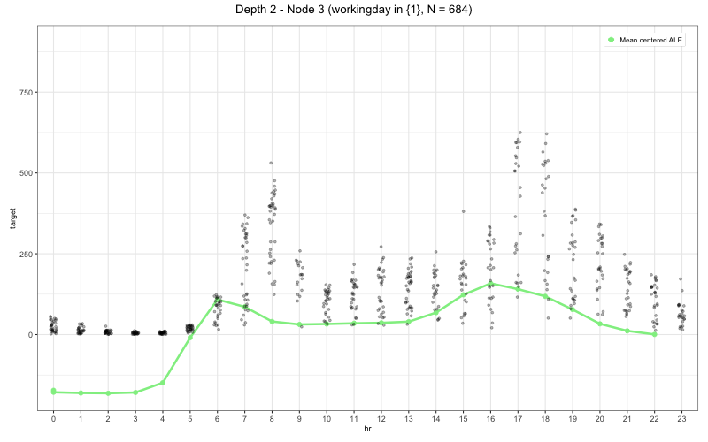

# xplaineff: Regional Feature Effects for Better Model Explanations

<!-- badges: start -->

[](https://www.repostatus.org/#active)

[](https://github.com/mlr-org/xplaineff/actions/workflows/R-CMD-check.yaml)
[](https://app.codecov.io/gh/mlr-org/xplaineff)

<!-- badges: end -->

The **xplaineff** R package implements the GADGET algorithm for interpretable machine learning. It recursively partitions the feature space to minimize the heterogeneity of feature effects (e.g., Accumulated Local Effects or Partial Dependence), producing a tree of regions where effects are more stable and easier to interpret. The package integrates with the [mlr3](https://mlr3.mlr-org.com/) ecosystem.

## Features

- **Interaction detection**: Identifies feature interactions by recursively splitting on heterogeneity of effects.
- **ALE and PD support**: `AleStrategy` for ALE (computed internally from a model), and `PdStrategy`
  for PD/ICE (via precomputed effects or internal computation from a model).
- **Visualization**: Tree structure plots and regional effect curves (ALE, PD, ICE).
- **Extensible design**: R6-based strategy pattern; plug in custom effect strategies.
- **Performance**: Core calculations in C++ (Rcpp/RcppArmadillo).

## Installation

Install the development version from GitHub:

```r
# install.packages("devtools")
devtools::install_github("mlr-org/xplaineff")
```

Requires R6, ggplot2, data.table, Rcpp; see [DESCRIPTION](DESCRIPTION) for details.

## API overview

| Component    | Description                                                                 |
|-------------|-----------------------------------------------------------------------------|
| `GadgetTree`| Main entry: `$new()`, `$fit()`, `$plot()`, `$plot_tree_structure()`, `$extract_split_info()` |
| `AleStrategy` | ALE-based trees; pass `model` to `$fit()`. ALE is computed internally.      |
| `PdStrategy`  | PD/ICE trees; pass `effect` or pass `model` for internal PD/ICE computation. |

**Fit arguments**

- **AleStrategy-specific**
  - `model` (required): fitted mlr3 learner used to compute ALE.
  - `effect` (reserved): currently not enabled; reserved for future extension.
  - `n_intervals` (optional): number of intervals for ALE grids (default: `10`).
  - `predict_fun` (optional): custom prediction function; if `NULL`, uses the learner’s default.
  - `order_method` (optional): how to order **categorical split-feature levels** before searching over binary splits.
    Internally, GADGET builds a pairwise distance matrix between levels (using other features), embeds it into
    1D, and searches ordered-prefix partitions.
    The learned order is only used to define candidate partitions; plots display category sets rather than
    implying a semantic ordering.
    Supported methods are:
    - `"raw"` (default): keep the original factor level order (no reordering).
    - `"mds"`: multi-dimensional scaling on the level-distance matrix, then order levels by the 1D coordinates.
    - `"pca"`: PCA on the level-distance matrix, then order levels by the first principal component.
    - `"random"`: use a random order of levels (mainly for robustness checks or baselines).
- **PdStrategy-specific**
  - `effect` (optional): object of class `FeatureEffects` (e.g. from `iml::FeatureEffects`).
  - `model` (optional): fitted model used for internal PD/ICE computation when `effect` is not provided.
  - `n_grid` (optional): number of grid points for numeric PD/ICE computation (default: `20`).
  - `predict_fun` (optional): custom prediction function for internal PD/ICE computation.
- **Shared tree arguments (both strategies)**
  - `feature_set` (optional): subset of features used to compute and plot effects.
  - `split_feature` (optional): subset of features allowed as splitting variables.
  - `impr_par`: minimum required improvement in heterogeneity to accept a split.
  - `min_node_size`: minimum number of observations in each node.
  - `n_quantiles`: number of candidate split points per numerical feature.

## Methodology

GADGET recursively partitions the feature space. At each node it:

1. Computes effect heterogeneity (e.g., variance of ALE derivatives or PD/ICE curves).
2. Searches for a split (on a chosen feature) that maximally reduces heterogeneity.
3. Splits if the reduction exceeds a threshold (`impr_par`) and node size is sufficient.

Splits isolate regions where feature effects are more stable, revealing interaction structure.

## Quick Start

This section shows how to use GADGET with **PD** and **ALE** on the **Bikeshare** data.
We first build a PD-based tree with internally computed effects, then an ALE-based tree with internally computed
effects.

### PD + Bikeshare

```r
library(xplaineff)
library(mlr3)
library(mlr3learners)
library(ISLR2)

# 1) Load and subsample the Bikeshare data
data("Bikeshare", package = "ISLR2")
set.seed(123)
bike = Bikeshare[sample(seq_len(nrow(Bikeshare)), 1000), ]
bike$workingday = as.factor(bike$workingday)
bike_data = bike[, c("hr", "temp", "workingday", "bikers")]
names(bike_data)[names(bike_data) == "bikers"] = "target"

# 2) Fit a black-box regression model with mlr3
task = TaskRegr$new(id = "bike", backend = bike_data, target = "target")
learner = lrn("regr.ranger")
learner$train(task)

# 3) Grow a PD-based GadgetTree on top of the model
tree = GadgetTree$new(
  strategy = PdStrategy$new(),
  n_split = 2,
  min_node_size = 50
)
tree$fit(
  data = bike_data,
  target_feature_name = "target",
  model = learner,
  n_grid = 20L
)

# 4) Inspect the tree structure, splits, and regional PD/ICE curves
tree$plot_tree_structure()
tree$extract_split_info()
tree$plot(
  data = bike_data,
  target_feature_name = "target",
  features = c("hr", "temp")
)
```

> Pre-computed ICE/PD effects (e.g. from `iml::FeatureEffects`) can be passed via
> `tree$fit(effect = effect, ...)` instead of `model =`.

**Sample split info (PD + Bikeshare):**

| id | depth | n_obs | node_type | split_feature | split_value | node_objective | int_imp | int_imp_parent | split_feature_parent | split_value_parent | objective_value_parent | is_final | time |
|---|---|---|---|---|---|---|---|---|---|---|---|---|---|
| 1 | 1 | 1000 | root | workingday | 1 | 18716935 | 0.37 | NA | NA | NA | NA | FALSE | 0.002 |
| 2 | 2 | 684 | left | temp | 0.51 | 7283101 | 0.32 | 0.37 | workingday | 1 | 18716935 | FALSE | 0.002 |
| 3 | 2 | 316 | right | temp | 0.45 | 4558235 | 0.21 | 0.37 | workingday | 1 | 18716935 | FALSE | 0.002 |
| 4 | 3 | 345 | left | NA | NA | 508581 | NA | 0.32 | temp | 0.51 | 7283101 | TRUE | NA |
| 5 | 3 | 339 | right | NA | NA | 694544 | NA | 0.32 | temp | 0.51 | 7283101 | TRUE | NA |
| 6 | 3 | 148 | left | NA | NA | 271085 | NA | 0.21 | temp | 0.45 | 4558235 | TRUE | NA |
| 7 | 3 | 168 | right | NA | NA | 268604 | NA | 0.21 | temp | 0.45 | 4558235 | TRUE | NA |

**Tree structure and regional PD/ICE plots (root and first split):**


### ALE + Bikeshare

```r
library(xplaineff)
library(mlr3)
library(mlr3learners)
library(ISLR2)

# 1) Load and subsample the Bikeshare data
data("Bikeshare", package = "ISLR2")
set.seed(123)
bike = Bikeshare[sample(seq_len(nrow(Bikeshare)), 1000), ]
bike$workingday = as.factor(bike$workingday)
bike_data = bike[, c("hr", "temp", "workingday", "bikers")]
names(bike_data)[names(bike_data) == "bikers"] = "target"

# 2) Fit a black-box regression model with mlr3
task = TaskRegr$new(id = "bike", backend = bike_data, target = "target")
learner = lrn("regr.ranger")
learner$train(task)

# 3) Grow an ALE-based GadgetTree on top of the model
tree = GadgetTree$new(
  strategy = AleStrategy$new(),
  n_split = 2,
  impr_par = 0.01,
  min_node_size = 50
)
tree$fit(
  data = bike_data,
  target_feature_name = "target",
  model = learner,
  n_intervals = 10
)

# 4) Inspect the tree structure, splits, and regional ALE plots
tree$plot_tree_structure()  # prints the tree topology (depth, node IDs, split features)
tree$extract_split_info()
tree$plot(
  data = bike_data,
  target_feature_name = "target",
  features = c("hr", "temp"),
  mean_center = TRUE
)
```

**Sample split info (ALE + Bikeshare):**

| id | depth | n_obs | node_type | split_feature | split_value | node_objective | int_imp | int_imp_parent | int_imp_hr | int_imp_temp | int_imp_workingday | split_feature_parent | split_value_parent | objective_value_parent | is_final | time |
|---|---|---|---|---|---|---|---|---|---|---|---|---|---|---|---|---|
| 1 | 1 | 1000 | root | workingday | 0 | 2220499 | 0.9 | NA | 0.68 | 0.17 | 1 | NA | NA | NA | FALSE | 0.055 |
| 2 | 2 | 316 | left | NA | NA | 49880 | NA | 0.9 | NA | NA | NA | workingday | 0 | 2220499 | TRUE | NA |
| 3 | 2 | 684 | right | temp | 0.47 | 167776 | 0.04 | 0.9 | 0.21 | 0 | 0 | workingday | 0 | 2220499 | FALSE | 0.009 |
| 6 | 3 | 316 | left | NA | NA | 25506 | NA | 0.04 | NA | NA | NA | temp | 0.47 | 167776 | TRUE | NA |
| 7 | 3 | 368 | right | NA | NA | 50858 | NA | 0.04 | NA | NA | NA | temp | 0.47 | 167776 | TRUE | NA |

**Tree structure and regional ALE plots (root and first split):**






## More plot options

The `tree$plot()` method is flexible and can be used to drill down into specific depths, nodes, and features.
It always returns a nested list of plot objects named by depth and by the actual tree node id, for example
`pl$Depth_2$Node_3`.

- **Controlling which nodes to plot**

  ```r
  # Only depth 1 (root)
  pl = tree$plot(
    data = bike_data,
    target_feature_name = "target",
    features = c("hr", "temp"),
    depth = 1
  )

  # A specific node at depth 2 (e.g., right child)
  pl = tree$plot(
    data = bike_data,
    target_feature_name = "target",
    features = c("hr", "temp"),
    depth = 2,
    node_id = 3  # see node IDs in tree$plot_tree_structure()
  )

  # Inspect or manually print a single plot object
  print(pl$Depth_2$Node_3)
  ```

- **Selecting features and centering**

  ```r
  # Only plot effects for "hr", without mean-centering
  pl = tree$plot(
    data = bike_data,
    target_feature_name = "target",
    features = "hr",
    mean_center = FALSE
  )
  ```

- **Overlaying raw observations**

  If available for your strategy, you can overlay observed \((x, y)\) points on top of the regional curves:

  ```r
  pl = tree$plot(
    data = bike_data,
    target_feature_name = "target",
    features = c("hr", "temp"),
    mean_center = TRUE,
    show_point = TRUE  # add raw data points
  )
  ```

In practice, a common workflow is:

1. Use `tree$plot_tree_structure()` and `tree$extract_split_info()` to identify interesting regions.
2. Call `tree$plot()` with `depth` / `node_id` / `features` to inspect those regions.
3. Manually inspect or save individual plots with named entries such as `print(pl$Depth_2$Node_3)`.

## Documentation

- In R: `?xplaineff`, `?GadgetTree`, `?AleStrategy`, `?PdStrategy`

## Citation

Herbinger, J., Wright, M. N., Nagler, T., Bischl, B., and Casalicchio, G. (2024). Decomposing Global Feature Effects Based on Feature Interactions. *Journal of Machine Learning Research*, 25(23-0699), 1–65. <https://jmlr.org/papers/volume25/23-0699/23-0699.pdf>

## License

MIT
