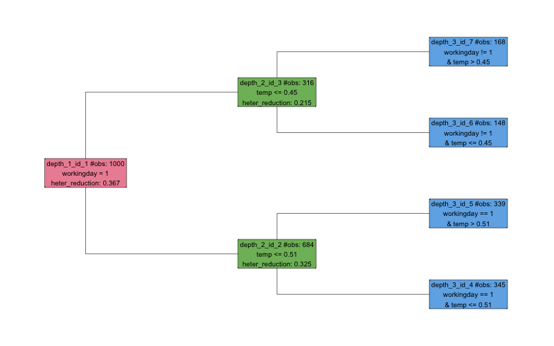
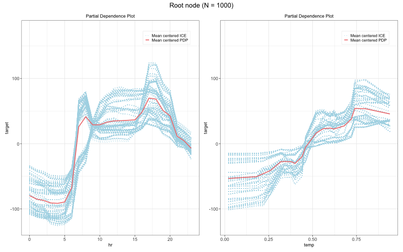
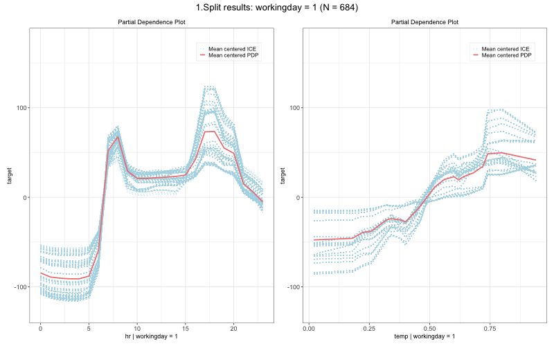
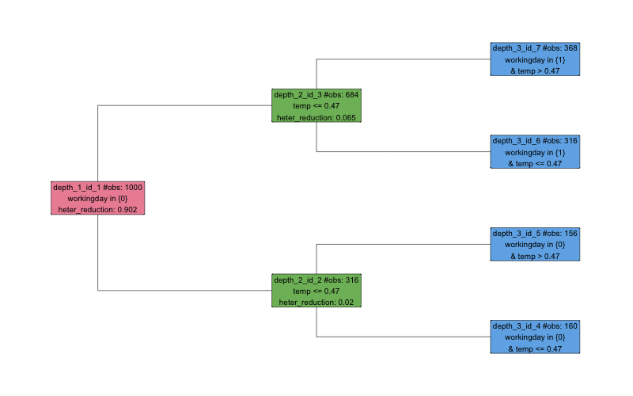
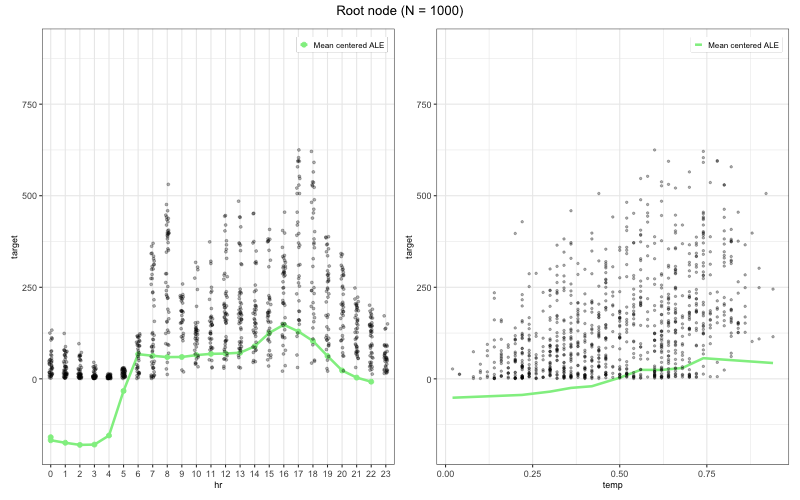
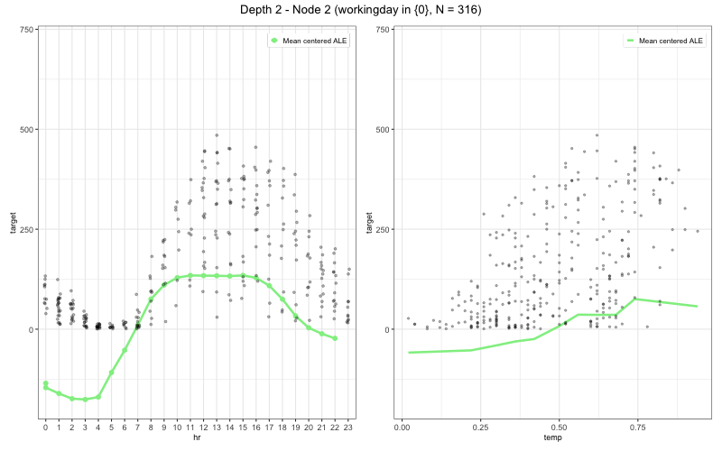

# GADGET: General Additive Decomposition based on Global Effects

<!-- badges: start -->

[](https://github.com/mlr-org/gadget/actions/workflows/R-CMD-check.yaml)

<!-- badges: end -->

The **gadget** R package implements the GADGET algorithm for interpretable machine learning. It recursively partitions the feature space to minimize the heterogeneity of feature effects (e.g., Accumulated Local Effects or Partial Dependence), producing a tree of regions where effects are more stable and easier to interpret. The package integrates with the [mlr3](https://mlr3.mlr-org.com/) ecosystem.

## Features

- **Interaction detection**: Identifies feature interactions by recursively splitting on heterogeneity of effects.
- **ALE and PD support**: `AleStrategy` for ALE (computed internally), `PdStrategy` for PD/ICE (via precomputed effects from iml or similar).
- **Visualization**: Tree structure plots and regional effect curves (ALE, PD, ICE).
- **Extensible design**: R6-based strategy pattern; plug in custom effect strategies.
- **Performance**: Core calculations in C++ (Rcpp/RcppArmadillo).

## Installation

Install the development version from GitHub:

```r
# install.packages("devtools")
devtools::install_github("mlr-org/gadget")
```

Requires R6, ggplot2, data.table, Rcpp; see [DESCRIPTION](DESCRIPTION) for details.

## API overview

| Component    | Description                                                                 |
|-------------|-----------------------------------------------------------------------------|
| `GadgetTree`| Main entry: `$new()`, `$fit()`, `$plot()`, `$plot_tree_structure()`, `$extract_split_info()` |
| `AleStrategy` | ALE-based trees; pass `model` to `$fit()`. ALE computed internally.      |
| `PdStrategy`  | PD/ICE trees; pass `effect` (e.g. from `iml::FeatureEffects`) to `$fit()`. |

**Fit arguments**

- **AleStrategy**: `model` (required), `n_intervals = 10`, `predict_fun = NULL`, `order_method = "raw"`, `with_stab = FALSE`
- **PdStrategy**: `effect` (required)
- **Both**: `feature_set`, `split_feature` (optional); tree params: `impr_par`, `min_node_size`, `n_quantiles`

## Methodology

GADGET recursively partitions the feature space. At each node it:

1. Computes effect heterogeneity (e.g., variance of ALE derivatives or PD/ICE curves).
2. Searches for a split (on a chosen feature) that maximally reduces heterogeneity.
3. Splits if the reduction exceeds a threshold (`impr_par`) and node size is sufficient.

Splits isolate regions where feature effects are more stable, revealing interaction structure.

## Quick Start

This section shows how to use GADGET with **PD** and **ALE** on the **Bikeshare** data.  
We first build a PD-based tree (with effects computed via `iml`), then an ALE-based tree (effects computed internally).

### PD + Bikeshare (requires iml)

For PD/ICE, compute effects with [iml](https://cran.r-project.org/package=iml) first, then pass them to `PdStrategy`:

```r
library(gadget)
library(iml)
library(mlr3)
library(mlr3learners)
library(ISLR2)

# 1) Load data and fit a black-box model
data("Bikeshare", package = "ISLR2")
set.seed(123)
bike = Bikeshare[sample(seq_len(nrow(Bikeshare)), 1000), ]
bike$workingday = as.factor(bike$workingday)
bike_data = bike[, c("hr", "temp", "workingday", "bikers")]
names(bike_data)[names(bike_data) == "bikers"] = "target"

task = TaskRegr$new(id = "bike", backend = bike_data, target = "target")
learner = lrn("regr.ranger")
learner$train(task)

# 2) Compute ICE/PD effects with iml
predictor = iml::Predictor$new(
  model = learner,
  data = bike_data[, c("hr", "temp", "workingday")],
  y = bike_data$target
)
effect = iml::FeatureEffects$new(
  predictor,
  method = "ice",
  grid.size = 20
)

# 3) Grow a PD-based GadgetTree on the iml effects
tree = GadgetTree$new(
  strategy = PdStrategy$new(),
  n_split = 2,
  min_node_size = 50
)
tree$fit(
  data = bike_data,
  target_feature_name = "target",
  effect = effect
)

# 4) Visualize tree structure and regional PD/ICE curves
tree$plot_tree_structure()  # prints the tree topology (depth, node IDs, split features)
tree$extract_split_info()
tree$plot(
  effect = effect,
  data = bike_data,
  target_feature_name = "target",
  features = c("hr", "temp")
)
```

**Sample split info (PD + Bikeshare):**

| id | depth | n_obs | node_type | split_feature | split_value | node_objective | int_imp | int_imp_parent | split_feature_parent | split_value_parent | objective_value_parent | is_final | time  |
|----|-------|-------|-----------|---------------|-------------|----------------|---------|-----------------|----------------------|--------------------|------------------------|----------|-------|
| 1  | 1     | 1000  | root      | workingday    | 0           | 19724312.3     | 0.36    | NA              | &lt;NA&gt;               | &lt;NA&gt;               | NA                     | FALSE    | 0.002 |
| 2  | 2     | 316   | left      | temp          | 0.45        | 4795126.7      | 0.21    | 0.36            | workingday           | 0                  | 19724312              | FALSE    | 0.002 |
| 3  | 2     | 684   | right     | temp          | 0.51        | 7816195.0      | 0.33    | 0.36            | workingday           | 0                  | 19724312              | FALSE    | 0.002 |
| 4  | 3     | 148   | left      | &lt;NA&gt;        | &lt;NA&gt;        | 287650.3       | NA      | 0.21            | temp                 | 0.45               | 4795127               | TRUE     | NA    |
| 5  | 3     | 168   | right     | &lt;NA&gt;        | &lt;NA&gt;        | 286534.8       | NA      | 0.21            | temp                 | 0.45               | 4795127               | TRUE     | NA    |
| 6  | 3     | 345   | left      | &lt;NA&gt;        | &lt;NA&gt;        | 626584.2       | NA      | 0.33            | temp                 | 0.51               | 7816195               | TRUE     | NA    |
| 7  | 3     | 339   | right     | &lt;NA&gt;        | &lt;NA&gt;        | 747511.4       | NA      | 0.33            | temp                 | 0.51               | 7816195               | TRUE     | NA    |

**Tree structure and regional PD/ICE plots (root and first split):**







### ALE + Bikeshare

```r
library(gadget)
library(mlr3)
library(mlr3learners)
library(ISLR2)

# 1) Load and subsample the Bikeshare data
data("Bikeshare", package = "ISLR2")
set.seed(123)
bike = Bikeshare[sample(seq_len(nrow(Bikeshare)), 1000), ]
bike$workingday = as.factor(bike$workingday)
bike_data = bike[, c("hr", "temp", "workingday", "bikers")]
names(bike_data)[names(bike_data) == "bikers"] = "target"

# 2) Fit a black-box regression model with mlr3
task = TaskRegr$new(id = "bike", backend = bike_data, target = "target")
learner = lrn("regr.ranger")
learner$train(task)

# 3) Grow an ALE-based GadgetTree on top of the model
tree = GadgetTree$new(
  strategy = AleStrategy$new(),
  n_split = 2,
  impr_par = 0.01,
  min_node_size = 50
)
tree$fit(
  data = bike_data,
  target_feature_name = "target",
  model = learner,
  n_intervals = 10
)

# 4) Inspect the tree structure, splits, and regional ALE plots
tree$plot_tree_structure()  # prints the tree topology (depth, node IDs, split features)
tree$extract_split_info()
tree$plot(
  data = bike_data,
  target_feature_name = "target",
  features = c("hr", "temp"),
  mean_center = TRUE
)
```

**Sample split info (ALE + Bikeshare):**

| id | depth | n_obs | node_type | split_feature | split_value | node_objective | int_imp | int_imp_parent | int_imp_hr | int_imp_temp | int_imp_workingday | split_feature_parent | split_value_parent | objective_value_parent | is_final | time  |
|----|-------|-------|-----------|---------------|-------------|----------------|---------|-----------------|------------|--------------|---------------------|----------------------|--------------------|------------------------|----------|-------|
| 1  | 1     | 1000  | root      | workingday    | 0           | 2220499.170    | 0.90    | NA              | 0.68       | 0.17         | 1                   | &lt;NA&gt;               | &lt;NA&gt;               | NA                     | FALSE    | 0.006 |
| 2  | 2     | 316   | left      | temp          | 0.47        | 49879.915      | 0.02    | 0.90            | 0.04       | 0.27         | 0                   | workingday           | 0                  | 2220499.17             | FALSE    | 0.004 |
| 3  | 2     | 684   | right     | temp          | 0.47        | 167776.262     | 0.07    | 0.90            | 0.21       | 0.55         | 0                   | workingday           | 0                  | 2220499.17             | FALSE    | 0.004 |
| 4  | 3     | 160   | left      | &lt;NA&gt;        | &lt;NA&gt;        | 2978.705       | NA      | 0.02            | NA         | NA           | NA                  | temp                 | 0.47               | 49879.91               | TRUE     | NA    |
| 5  | 3     | 156   | right     | &lt;NA&gt;        | &lt;NA&gt;        | 2944.015       | NA      | 0.02            | NA         | NA           | NA                  | temp                 | 0.47               | 49879.91               | TRUE     | NA    |
| 6  | 3     | 316   | left      | &lt;NA&gt;        | &lt;NA&gt;        | 6558.701       | NA      | 0.07            | NA         | NA           | NA                  | temp                 | 0.47               | 167776.26              | TRUE     | NA    |
| 7  | 3     | 368   | right     | &lt;NA&gt;        | &lt;NA&gt;        | 16683.457      | NA      | 0.07            | NA         | NA           | NA                  | temp                 | 0.47               | 167776.26              | TRUE     | NA    |

**Tree structure and regional ALE plots (root and first split):**







## More plot options

The `tree$plot()` method is flexible and can be used to drill down into specific depths, nodes, and features.
It always returns a nested list of `ggplot2` objects indexed by depth and node.

- **Controlling which nodes to plot**

  ```r
  # Only depth 1 (root)
  pl = tree$plot(
    data = bike_data,
    target_feature_name = "target",
    features = c("hr", "temp"),
    depth = 1
  )

  # A specific node at depth 2 (e.g., right child)
  pl = tree$plot(
    data = bike_data,
    target_feature_name = "target",
    features = c("hr", "temp"),
    depth = 2,
    node_id = 3  # see node IDs in tree$plot_tree_structure()
  )

  # Inspect or manually print a single ggplot object
  print(pl[[2]][[1]])  # depth 2, first node
  ```

- **Selecting features and centering**

  ```r
  # Only plot effects for "hr", without mean-centering
  pl = tree$plot(
    data = bike_data,
    target_feature_name = "target",
    features = "hr",
    mean_center = FALSE
  )
  ```

- **Overlaying raw observations**

  If available for your strategy, you can overlay observed \((x, y)\) points on top of the regional curves:

  ```r
  pl = tree$plot(
    data = bike_data,
    target_feature_name = "target",
    features = c("hr", "temp"),
    mean_center = TRUE,
    show_point = TRUE  # add raw data points
  )
  ```

In practice, a common workflow is:

1. Use `tree$plot_tree_structure()` and `tree$extract_split_info()` to identify interesting regions.
2. Call `tree$plot()` with `depth` / `node_id` / `features` to inspect those regions.
3. Manually inspect or save individual plots with `print(pl[[d]][[k]])`.

## Documentation

- In R: `?gadget`, `?GadgetTree`, `?AleStrategy`, `?PdStrategy`
- Paper draft: [`paper/`](paper/) (see `paper/README.md`)

## Citation

Herbinger, J., Wright, M. N., Nagler, T., Bischl, B., and Casalicchio, G. (2024). Decomposing Global Feature Effects Based on Feature Interactions. *Journal of Machine Learning Research*, 25(23-0699), 1–65. <https://jmlr.org/papers/volume25/23-0699/23-0699.pdf>

## License

MIT
